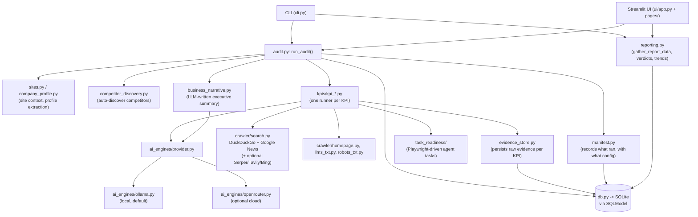

# Architecture

High-level map of how CitePulse is put together. For the "why local,
why free" product rationale see the [README](../README.md); for the
Windows packaging pipeline see [PACKAGING.md](PACKAGING.md). This doc
covers structure, not every module -- read the source's own docstrings
for the reasoning behind a specific design choice.

## Entry points

Two front doors call into the same core, so behavior never drifts
between them:

- **CLI** (`citepulse/cli.py`, Click) -- `citepulse audit`, `citepulse
  ui`, `citepulse sites`, `citepulse competitor ...`.
- **UI** (`citepulse/ui/app.py`, Streamlit) -- launched by `citepulse
  ui`; a multi-page app (Sites, Run Audit, History, Compare, Manage)
  under `citepulse/ui/pages/`.

Both call `citepulse/audit.py`'s `run_audit()` for the actual audit run
-- it is presentation-agnostic (raises plain exceptions, returns an
`AuditRun`), and both then render via `citepulse/reporting.py`.

## Core flow: `citepulse audit`

1. **Site setup** -- `sites.get_or_create_site()` persists the target
   URL; `company_profile.py` extracts/caches a company profile used to
   tailor prompts.
2. **Competitor discovery** (optional, gated by
   `settings.competitor_discovery_enabled`) -- `competitor_discovery.py`
   proposes competitor domains via web search + LLM classification;
   only `confidence == "high"` candidates auto-commit, everything else
   waits for manual review on the Manage page.
3. **KPI runners** -- `audit.py` iterates a fixed, order-paired list of
   runners in `citepulse/kpis/kpi_*.py` (`kpi_1`, `kpi_22`, `kpi_24`,
   `kpi_45`, `kpi_46`, `kpi_48`, `kpi_58`, `kpi_62` -- see
   `kpi_catalog.py` for the human-readable names). Each runner is
   independent and returns a `KPIResult`; a runner that can't measure
   something returns "not determined" rather than a fabricated score.
4. **Evidence & manifest** -- `evidence_store.py` persists the raw
   inputs behind each KPI (search hits, fetched pages, task traces) and
   `manifest.py` records what ran and with what configuration, so a run
   is reproducible/auditable after the fact.
5. **Narrative** -- `business_narrative.py` asks the configured LLM to
   turn KPI results into an executive summary and per-finding
   explanations (never asked to invent facts, only to phrase existing
   ones).
6. **Persistence** -- everything lands in SQLite via `db.py`
   (SQLModel); `reporting.py` reads it back for the CLI's text report,
   the UI's History/Compare pages, and multi-run trend views.

## External access -- keyless by default

CitePulse talks to external services directly over HTTP; there is no
intermediary service or vendored SDK in between.

- **Web search** (`citepulse/crawler/search.py`): DuckDuckGo (via the
  `ddgs` library) and Google News RSS are the primary, unauthenticated
  path. Serper/Tavily/Bing are optional bring-your-own-key fallbacks,
  only attempted if the primary path returns nothing *and* the
  corresponding key is set in `.env`.
- **LLM inference** (`citepulse/ai_engines/`): local Ollama is the
  default and requires no key. `provider.py` is the single dispatch
  point every other module calls through (never `ollama.py`/
  `openrouter.py` directly) -- a model string prefixed `openrouter:`
  routes to the optional OpenRouter cloud path instead.
- **Task-readiness checks** (`task_readiness/`): drives a real browser
  via Playwright against the target site itself -- no third-party API.

All optional keys (`OPENAI_API_KEY`, `ANTHROPIC_API_KEY`,
`PERPLEXITY_API_KEY`, `SERPER_API_KEY`, `TAVILY_API_KEY`,
`BING_API_KEY`) are read from environment variables via
`citepulse/settings.py` (pydantic `Settings`) and are `None` by
default -- see `.env.example`. None are required to run an audit.

## Data model

SQLite (local file, path from `CITEPULSE_DATA_DIR`) via SQLModel.
Key tables (`citepulse/models/`): `Site`, `AuditRun`, `KPIResult`,
`Finding`, `Evidence`, `Competitor`, `PromptSet`, `TaskRunResult`.
Schema changes since v1 are additive, applied via `db.py`'s
`_ensure_columns()` migration list rather than destructive ALTERs.
